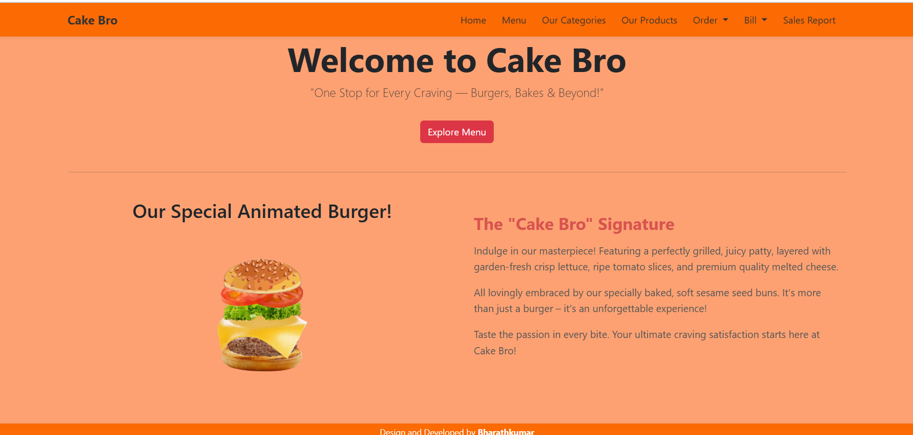
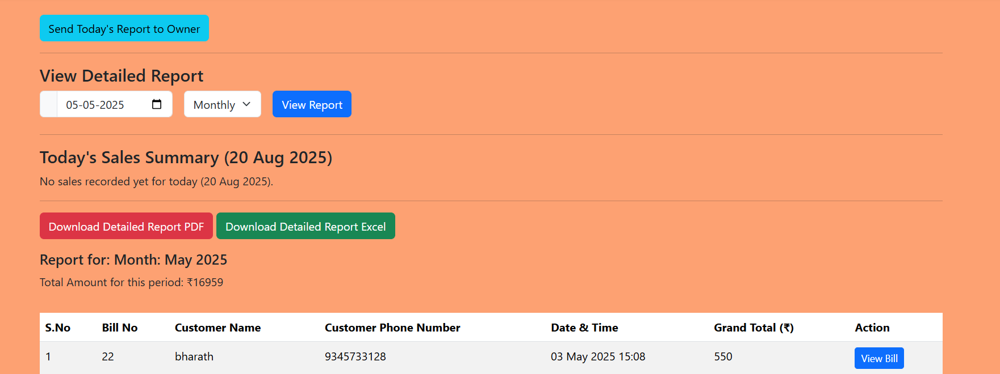

🍰 Bakery Management System

A **Bakery Billing & Inventory Management System** built with **Django** and **PostgreSQL**, styled using **Bootstrap**.  
This system helps bakery shops manage products, stock, billing, and daily sales with ease.  

🚀 Features
- 🛒 Product & Inventory Management with real-time stock updates  
- 📦 Automatic stock deduction after each sale  
- 🧾 Automated invoice generation with tax (printable & downloadable as PDF)  
- 📊 Daily sales & accounts reporting module  
- 👥 Multi-user support (Admin & Staff)  
- 🎨 Responsive UI with Bootstrap  


🛠️ Tech Stack
- **Backend**: Django  
- **Database**: PostgreSQL  
- **Frontend**: Bootstrap (HTML, CSS, JS)  
- **PDF Generation**: ReportLab / WeasyPrint (Django)  

 ⚡ Installation

### Prerequisites
- Python 3.x  
- PostgreSQL installed and running  
- Virtual environment (`venv`)  

 Setup
```bash
# Clone the repository
git clone https://github.com/yourusername/bakery-management-system.git
cd bakery-management-system

# Create and activate virtual environment
python -m venv venv
source venv/bin/activate   # On Windows: venv\Scripts\activate

# Install dependencies
pip install -r requirements.txt

# Setup database (PostgreSQL)
create DB in PostgreSQL and mention in project settings
python manage.py makemigrations
python manage.py migrate

# Create superuser
python manage.py createsuperuser

# Run the server
python manage.py runserver

# ScreenShots

### Home


### Menu


### Category


### Orders


### Order List


### Bill


### Bill List


### Add Product


### Sales Report 1


### Sales Report 2


